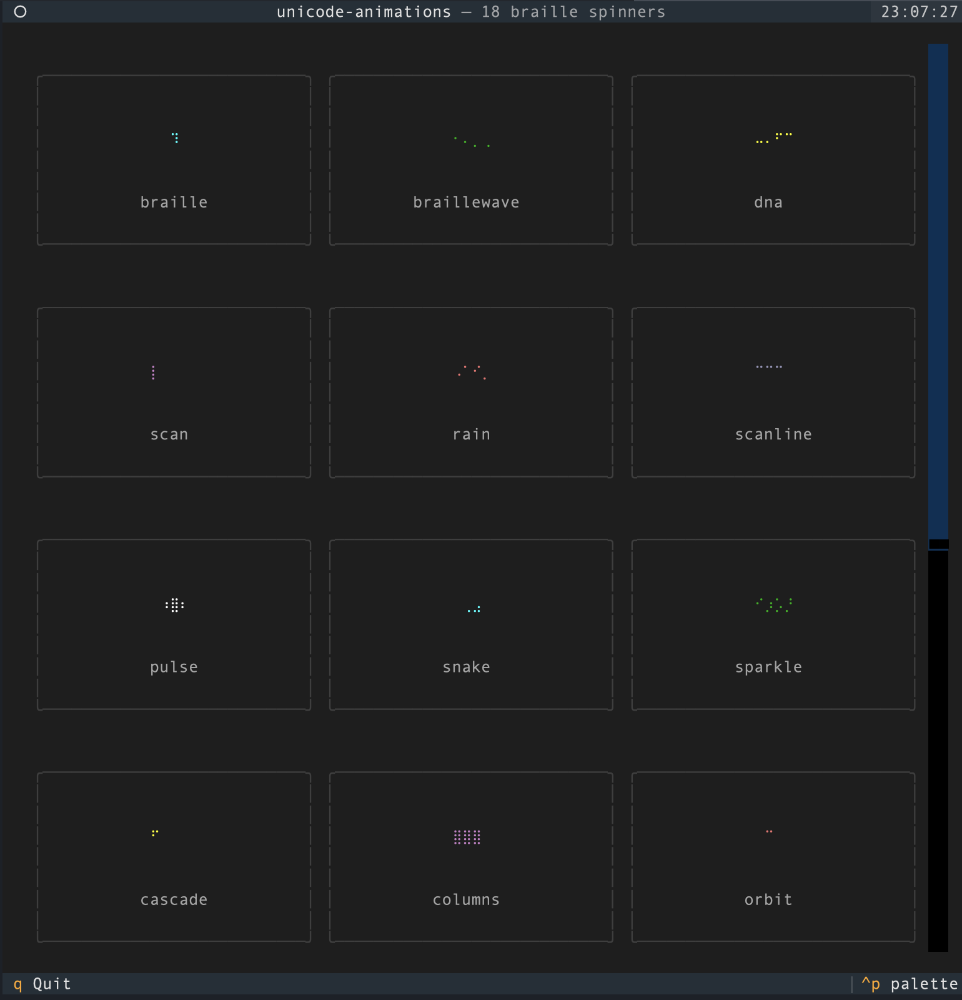

# unicode-animations

Python port of [gunnargray-dev/unicode-animations](https://github.com/gunnargray-dev/unicode-animations).

18 pre-built Unicode braille spinner animations, a ready-to-use `live_spinner` context manager for CLI apps, and grid utilities for building custom spinners. Zero dependencies — stdlib only.

## Install

```
uv add unicode-animations
```

## Quick start

```python
from unicode_animations import live_spinner
import time

with live_spinner("helix", text="Loading...", color="cyan"):
    time.sleep(3)
```

## Usage

### Live spinner for CLI apps

`LiveSpinner` runs animation in a background thread and cleans up automatically:

```python
from unicode_animations import live_spinner

# As a context manager
with live_spinner("dna", text="Downloading...", color="green"):
    do_work()

# Manual control
from unicode_animations import LiveSpinner

sp = LiveSpinner("helix", text="Processing...", color="cyan")
sp.start()
# ... do work ...
sp.stop(symbol="✓")  # stop with a final symbol
```

**Parameters:**

| Parameter | Type | Default | Description |
|-----------|------|---------|-------------|
| `name_or_spinner` | `str \| Spinner` | required | A spinner name or a `Spinner` instance |
| `text` | `str` | `""` | Status text shown next to the spinner |
| `color` | `str \| None` | `None` | ANSI color: `red`, `green`, `yellow`, `blue`, `magenta`, `cyan`, `white` |
| `stream` | `IO[str] \| None` | `stderr` | Output stream (non-TTY streams get a text-only fallback) |
| `scale` | `int` | `1` | Scale factor (2 or 3) for bigger rendering |

### Raw frame data

```python
from unicode_animations import spinners

spinner = spinners["helix"]
print(spinner.frames)    # tuple of animation frames
print(spinner.interval)  # ms between frames
```

### Custom spinners with the grid API

```python
from unicode_animations import make_grid, grid_to_braille, braille_to_grid

grid = make_grid(4, 2)   # 4 rows x 2 cols (one braille char)
grid[0][0] = True
grid[3][1] = True
print(grid_to_braille(grid))  # ⡁

# Decode back to grid
grid = braille_to_grid("⡁")
print(grid[0][0])  # True
```

### Scaling spinners

```python
from unicode_animations import spinners, scale_spinner

big = scale_spinner(spinners["helix"], factor=2)  # 2x bigger
print(big.frames[0])  # multi-line braille output
```

### Using in TUI frameworks

`LiveSpinner` is designed for simple CLI scripts. For TUI frameworks that manage the full screen (Textual, Rich, curses), use the raw frame data instead — it's just tuples of strings and an interval, so it plugs into any rendering system.

A full Textual gallery demo is included at [`examples/textual_demo.py`](examples/textual_demo.py):

```
uv run python examples/textual_demo.py
```



**Minimal Textual example:**

```python
from textual.app import App, ComposeResult
from textual.widgets import Static
from unicode_animations import spinners

class SpinnerWidget(Static):
    def on_mount(self) -> None:
        self.spinner = spinners["helix"]
        self.frame_idx = 0
        self.set_interval(self.spinner.interval / 1000, self.next_frame)

    def next_frame(self) -> None:
        self.update(self.spinner.frames[self.frame_idx % len(self.spinner.frames)])
        self.frame_idx += 1

class MyApp(App):
    def compose(self) -> ComposeResult:
        yield SpinnerWidget()

MyApp().run()
```

**Rich:**

```python
from rich.live import Live
import time
from unicode_animations import spinners

spinner = spinners["dna"]
with Live("", refresh_per_second=1000 / spinner.interval) as live:
    for i in range(100):
        live.update(spinner.frames[i % len(spinner.frames)])
        time.sleep(spinner.interval / 1000)
```

**curses:**

```python
import curses
import time
from unicode_animations import spinners

def main(stdscr):
    curses.curs_set(0)
    spinner = spinners["orbit"]
    for i in range(100):
        stdscr.addstr(0, 0, spinner.frames[i % len(spinner.frames)])
        stdscr.refresh()
        time.sleep(spinner.interval / 1000)

curses.wrapper(main)
```

### CLI demo

```
python -m unicode_animations                          # cycle through all
python -m unicode_animations helix                    # preview one
python -m unicode_animations helix --color cyan       # with color
python -m unicode_animations helix --scale 2          # bigger
python -m unicode_animations --list                   # list all names
python -m unicode_animations --list --scale 2         # list with scaled samples
python -m unicode_animations --duration 5             # set preview duration
```

## Available spinners

`braille` · `braillewave` · `dna` · `scan` · `rain` · `scanline` · `pulse` · `snake` · `sparkle` · `cascade` · `columns` · `orbit` · `breathe` · `waverows` · `checkerboard` · `helix` · `fillsweep` · `diagswipe`

## License

MIT
